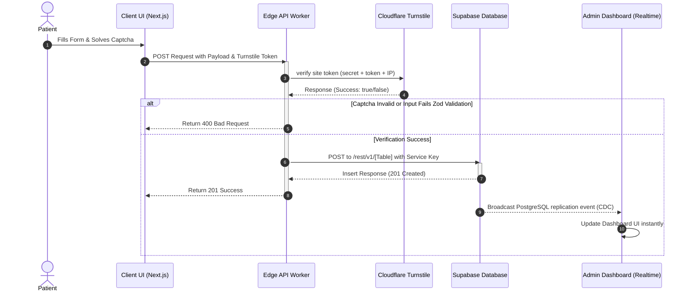

# PhysioVenture Noida - FullStack Website

A professional, high-performance, and secure web platform designed for the **PhysioVenture Neuro & Ortho Physiotherapy Clinic** based in Noida, Uttar Pradesh, India. Under the clinical leadership of **Dr. Rohit Verma** (Lead Physiotherapist & Clinical Director), the clinic specializes in Advanced Neurological Rehabilitation, Orthopaedic Rehabilitation, Sports Physiotherapy, Chiropractic, and Geriatric Care, with a strong emphasis on **Home Visits / In-Home Rehabilitation** across Noida.

---

## 1. Project Overview & Value Proposition

### Purpose & Problem Solved
PhysioVenture Noida's digital platform serves as the central hub for local patient acquisition, automated clinical triage, and booking management. Musculoskeletal and neurological rehabilitation patients often suffer from acute mobility limitations. Traveling to a clinic can exacerbate pain and delay recovery. 
This platform solves this barrier by:
1. **Promoting Specialized In-Home Care:** Enabling Noida residents to easily discover and request specialized physical therapy delivered directly to their homes.
2. **Eliminating Patient Friction:** Providing a modern, searchable, and mobile-friendly multi-step booking interface.
3. **Establishing Local Authority:** Employing location-centric local SEO patterns (sectors and neighborhoods in Noida) to build search presence.
4. **Providing Spam-Free Lead Triage:** Protecting operations using serverless captcha verification and data validation.

### Architectural Approach
The platform is built on a high-throughput, low-latency, and serverless architecture:
- **Edge-First Rendering:** Leverages **Next.js 16 (App Router)** and **React 19**, compiled and deployed on **Cloudflare Pages** using the `@cloudflare/next-on-pages` adapter. All pages and API endpoints are built to run on the Cloudflare Edge Runtime.
- **Secure Lead Capture Pipeline:** To bypass the latency of traditional databases and avoid exposure of direct database credentials, client forms are validated using **Zod** and verified using **Cloudflare Turnstile** captcha tokens at Edge API routes.
- **Supabase Backend Proxy:** Verified Edge routes act as secure database proxies. They write payloads into **Supabase PostgreSQL** using a private service-role API key, enforcing **Row Level Security (RLS)** to disable all public write actions.
- **Realtime Admin Control:** Administrative staff monitor, manage, and transition leads (Appointments & Inquiries) in real time using a custom obfuscated admin console connected to Supabase Realtime PG replication.

---

## 2. Key Features

- **Dynamic, SEO-Optimized Service Pages:** Dynamically compiled landing pages for 6 major physiotherapy disciplines under `/services/[slug]/`. These pages are enriched with localized SEO metadata ("in Noida", "Home Visits"), symptom check-lists, benefits, and customized FAQs.
- **Interactive Multi-Step Appointment Scheduler:** A dynamic booking portal utilizing a unified `ServiceCombobox` component. It automatically extracts, categorizes, and search-indexes primary disciplines and 23 seeded secondary conditions.
- **Spam-Protected Contact & Inquiries Pipeline:** Client forms validated with **React Hook Form** + **Zod** schema validations, sanitized against XSS injections, and protected with **Cloudflare Turnstile** invisible captcha checks.
- **Obfuscated Admin Dashboard:** Located at a cryptographically randomized path (`/admin-cr7m10vk18msd7r45n16`) to deter brute-force attempts. It includes:
  - **Live Lead Metrics:** Real-time statistics counters showing pending, completed, cancelled, and total appointments.
  - **Interactive Triage Board:** Filterable lists of appointments and inquiries with instant search capabilities.
  - **Single-Click Status Updates:** Status change actions that instantly synchronize with the Supabase database.
  - **Realtime Database Subscriptions:** Uses Postgres Change Data Capture (CDC) replication to automatically refresh the board on incoming patient requests without polling.
  - **Direct Actions:** Interactive triggers to call, email, or initiate WhatsApp pre-configured chats directly with patients.
- **Automated Local SEO Assets:** Dynamic sitemap generators (`sitemap.ts`) and JSON-LD schema injections (`MedicalBusiness` and `Physiotherapy` schemas) for semantic indexing.

---

## 3. Tech Stack & Dependencies

| Category | Technology / Library | Version / Details | Purpose |
| :--- | :--- | :--- | :--- |
| **Core Framework** | Next.js | `16.2.6` | App Router, Dynamic Edge API Routes, and Layouts |
| **Runtime Library** | React / React-DOM | `19.2.4` | Component architecture and UI state hydration |
| **Language** | TypeScript | `^5` | Compile-time static typing and interface compliance |
| **Styling & Theme** | Tailwind CSS | `^4.0.0` | Zero-runtime CSS variables, utilities, and grids |
| **Animations** | Framer Motion | `^12.39.0` | High-performance layouts and micro-interactions |
| **UI Components** | Radix UI (shadcn) | Primitives | Accessible accordion, dialog, popover, sheet, and drawers |
| **Database** | Supabase PostgreSQL | API v2 / REST | Relational database storage, schema management, and RLS |
| **Form Handling** | React Hook Form | `^7.76.0` | Client-side form state and submission tracking |
| **Data Validation** | Zod | `^4.4.3` | Input schemas, data normalization, and XSS sanitization |
| **DevOps / Edge** | Cloudflare Pages | Edge Workers | Edge hosting platform and serverless execution |
| **Build Adapter** | `@cloudflare/next-on-pages`| `^1.13.16` | Packs Next.js pages and APIs into Cloudflare Workers |
| **Local Emulator** | Wrangler | `^4.98.0` | Local Edge Runtime server simulation and preview tool |
| **Spam Protection** | Cloudflare Turnstile | Client & Server | Spam and bot-prevention validation check |

---

## 4. Architecture & Directory Structure

### Directory Tree

```
.
├── public/                                 # Static assets (images, logos, videos)
│   ├── images/                             # Service illustrations, logos, and avatars
│   ├── Media_Assets/4520181-hd_1920_1080_30fps.mp4  # Background video assets
│   └── Media_Assets/6111095-uhd_3840_2160_25fps.mp4 # Core promotional video
├── src/                                    # Application Source Code
│   ├── app/                                # Next.js App Router root
│   │   ├── (public)/                       # Public-facing page routes group
│   │   │   ├── about/                      # About clinic and founder biography
│   │   │   ├── blogs/                      # Blog articles list and details ([slug])
│   │   │   ├── book/                       # Multi-step booking UI
│   │   │   ├── contact/                    # Direct contact page & contact form
│   │   │   ├── privacy/                    # Privacy policy legal template
│   │   │   ├── services/                   # Services hub and service details ([slug])
│   │   │   ├── terms/                      # Terms and conditions legal template
│   │   │   ├── testimonials/               # Comprehensive reviews filter dashboard
│   │   │   ├── layout.tsx                  # Public layout (Header & Footer wrapper)
│   │   │   └── page.tsx                    # Interactive clinic homepage UI
│   │   ├── actions/                        # Client-side utility direct actions
│   │   │   └── admin.ts                    # Direct Supabase API client-side updates (fallback)
│   │   ├── admin/                          # Redirection and routing backup (empty)
│   │   ├── admin-cr7m10vk18msd7r45n16/     # Obfuscated Admin Dashboard UI
│   │   │   ├── login/                      # Admin credentials input & Turnstile widget
│   │   │   ├── layout.tsx                  # Dashboard layout wrapper (Header, Sidebar)
│   │   │   └── page.tsx                    # Stats board and Lead management console
│   │   ├── admin-dfhfvjhzbdsvhjzdgvbjhzbdv/# Obfuscated Admin Edge API endpoints
│   │   │   ├── get-bookings/               # GET: Returns all bookings and inquiries
│   │   │   └── update-status/              # POST: Updates booking/inquiry status
│   │   ├── api/                            # Public Edge API endpoints
│   │   │   ├── admin-login/                # Credentials check & Supabase Auth token generator
│   │   │   ├── bookings/                   # Validates and creates a booking request
│   │   │   ├── contact/                    # Validates and creates a contact inquiry
│   │   │   ├── enquiries/                  # Validates and creates a quick enquiry
│   │   │   └── verify-captcha/             # Verifies Turnstile tokens directly
│   │   ├── error.tsx                       # Standard Next.js error boundary
│   │   ├── global-error.tsx                # Edge-level crash recovery screen
│   │   ├── globals.css                     # Global styles importing Tailwind CSS v4
│   │   ├── layout.tsx                      # Main app wrapper (HTML, Body, Fonts)
│   │   └── sitemap.ts                      # Dynamic sitemap generator
│   ├── components/                         # Modular React components
│   │   ├── admin/                          # Dashboard components (Header, Sidebar, guards)
│   │   ├── home/                           # Homepage widgets (Hero video, Symptoms grid)
│   │   ├── services/                       # Service cards, filterable list UI
│   │   ├── shared/                         # Global elements (Navbar, Footer, FAQ, SEO Blocks)
│   │   ├── testimonials/                   # Testimonials filter and list UI
│   │   ├── ui/                             # Radix and custom styling components
│   │   └── service-combobox.tsx            # Classified search dropdown for scheduler
│   ├── hooks/                              # Custom React Hooks
│   │   ├── use-media-query.ts              # Responsive desktop/mobile screen checking
│   │   ├── useAdminAuth.ts                 # Validates active admin auth session and role
│   │   └── useAdminRealtime.ts             # Postgres changes realtime listener
│   └── lib/                                # Static configurations, clients, and schemas
│       ├── adminAuth.ts                    # Server-side auth token parser
│       ├── blogs-data.ts                   # Static blog content seeds
│       ├── constants.ts                    # Business info (coordinates, hours, phones)
│       ├── services-data.ts                # Service metadata and details seed
│       ├── supabase.ts                     # Instantiates public anon Supabase client
│       ├── utils.ts                        # Tailwind merge utility helper
│       ├── validation.ts                   # Zod schemas for input validation & sanitation
│       └── verifyTurnstile.ts              # Helper function for Cloudflare Captcha verification
├── admin_migration.sql                     # SQL script to set up notifications and alter tables
├── supabase_schema.sql                     # Core SQL database schema setup and services seeds
├── next.config.ts                          # Next.js optimization configuration
├── wrangler.toml                           # Local Cloudflare pages worker configuration
├── package.json                            # Package manifest and build scripts
└── eslint.config.mjs                       # Project ESLint custom configurations
```

### Application Data Flow



---

## 5. Getting Started & Installation

### Prerequisites
Before setting up the project locally, ensure you have the following installed:
- **Node.js:** Version `20.x` or later (LTS recommended).
- **npm:** Packaged default with Node.js.
- **Git:** Version control.
- **Supabase Account:** Access to a PostgreSQL Database instance.
- **Cloudflare Account:** Access to Turnstile Site & Secret keys.

### Local Setup Steps

1. **Clone the Repository:**
   ```bash
   git clone https://github.com/nishantkumar9959/PhysioVenture-Noida-FullStack-Website.git
   cd PhysioVenture-Noida-FullStack-Website
   ```

2. **Install Project Dependencies:**
   ```bash
   npm install
   ```

3. **Configure Environment Variables:**
   Create a `.env.local` file in the root directory and copy the contents below, filling in your Supabase and Turnstile keys.
   ```bash
   cp .env.example .env.local
   ```

### Environment Variables Template (`.env.local`)
Configure these keys carefully. Ensure they match your Supabase Dashboard API keys and Cloudflare Turnstile Settings.

```env
# =========================================================================
# PhysioVenture Noida - Environment Variables Configuration
# =========================================================================

# 1. Supabase Client Settings (Used client-side in browser)
NEXT_PUBLIC_SUPABASE_URL="https://your-project-id.supabase.co"
NEXT_PUBLIC_SUPABASE_PUBLISHABLE_KEY="your-anon-publishable-key-here"

# 2. Cloudflare Turnstile Client Settings (Used for widget rendering)
NEXT_PUBLIC_CLOUDFLARE_TURNSTILE_SITE_KEY="your-turnstile-site-sitekey"

# 3. Production Website Domain
NEXT_PUBLIC_SITE_URL="http://localhost:3000"

# =========================================================================
# 4. Cloudflare Pages Functions (Edge Workers) Runtime Variables
# These must be configured in BOTH your local ".env.local" file for Wrangler
# and in your Cloudflare Pages Dashboard (Settings > Environment Variables)
# =========================================================================
TURNSTILE_SECRET_KEY="your-turnstile-secret-key-here"
CF_TURNSTILE_SECRET_KEY="your-turnstile-secret-key-here"

SUPABASE_URL="https://your-project-id.supabase.co"
SUPABASE_SECRET_KEY="your-supabase-service-role-secret-key-here"
SUPABASE_PUBLISHABLE_KEY="your-anon-publishable-key-here"
```

---

## 6. Usage & Run Commands

You can interact with the project using the standard npm scripts defined in the package manifest:

### Local Development Server
To launch the Next.js development server with hot-reloading:
```bash
npm run dev
```
Open [http://localhost:3000](http://localhost:3000) to view the homepage.

### Next.js Production Build
To compile the project and optimize pages using Next.js native compilers:
```bash
npm run build
```

### Static Exports & Wrangler Edge Emulation
Because this application is designed to run on Cloudflare Pages Workers, you can emulate the edge worker runtime environment locally:
```bash
# Build for Cloudflare Pages
npx @cloudflare/next-on-pages

# Run the local Wrangler pages preview on port 8788
npx wrangler pages dev .next_build_final --compatibility-flag=nodejs_compat
```

### Quality Control & Linting
Run static analysis checks on files:
```bash
npm run lint
```

*Note: There are no testing frameworks (such as Jest or Cypress) configured in this project. Code validation is performed using ESLint and compile-time TypeScript type checking.*

---

## 7. API Endpoints / Core Modules

### Public API Endpoints
All public endpoints are deployed on the **Cloudflare Edge Runtime** (`export const runtime = "edge"`).

#### 1. Appointment Booking (`/api/bookings`)
- **Method:** `POST`
- **Content-Type:** `application/json`
- **Request Body:**
  ```json
  {
    "patient_name": "John Doe",
    "email": "john.doe@example.com",
    "phone": "+919876543210",
    "service_id": "back-pain-treatment",
    "preferred_date": "2026-06-25",
    "preferred_time_slot": "morning",
    "additional_notes": "Radiating lower back pain",
    "turnstileToken": "cloudflare-turnstile-captcha-token"
  }
  ```
- **Actions:** Sanitizes inputs, verifies the `turnstileToken` with Cloudflare siteverify, and inserts the data into the Supabase database table `appointment_requests` (returns `201 Created`).

#### 2. Contact Submission (`/api/contact`)
- **Method:** `POST`
- **Content-Type:** `application/json`
- **Request Body:**
  ```json
  {
    "name": "Jane Smith",
    "email": "jane@example.com",
    "phone": "+919988776655",
    "message": "Enquiry regarding spinal decompression therapy.",
    "turnstileToken": "cloudflare-turnstile-captcha-token"
  }
  ```
- **Actions:** Verifies token and inserts record into Supabase database table `contact_inquiries`.

#### 3. Client Captcha Verification (`/api/verify-captcha`)
- **Method:** `POST`
- **Request Body:** `{ "token": "turnstile-token" }`
- **Actions:** Dispatcher endpoint verifying Turnstile tokens directly with Cloudflare.

#### 4. Quick Enquiries (`/api/enquiries`)
- **Method:** `POST`
- **Request Body:** `{ "name": "...", "phone": "...", "symptom_details": "...", "source_service": "...", "turnstileToken": "..." }`
- **Actions:** Registers direct home visit quick requests in `patient_enquiries`.

---

### Protected Admin API Endpoints (`/admin-dfhfvjhzbdsvhjzdgvbjhzbdv`)
These endpoints require an `Authorization` header containing a valid user JWT issued by Supabase Auth (`Bearer <token>`).

#### 1. Get Dashboard Leads (`/admin-dfhfvjhzbdsvhjzdgvbjhzbdv/get-bookings`)
- **Method:** `GET`
- **Authorization:** `Bearer <jwt_token>`
- **Response:**
  ```json
  {
    "success": true,
    "appointments": [...],
    "inquiries": [...]
  }
  ```
- **Actions:** Checks admin role in `admin_users` table and executes concurrent fetches for `appointment_requests` and `contact_inquiries` using the Supabase Service Key.

#### 2. Update Lead Status (`/admin-dfhfvjhzbdsvhjzdgvbjhzbdv/update-status`)
- **Method:** `POST`
- **Authorization:** `Bearer <jwt_token>`
- **Request Body:**
  ```json
  {
    "id": "appointment-or-inquiry-uuid",
    "type": "appointment" | "inquiry",
    "status": "confirmed" | "cancelled" | "completed" | "contacted" | "closed"
  }
  ```
- **Actions:** Patches the `status` field in the respective table (`appointment_requests` or `contact_inquiries`) using the Supabase Service Role key.

---

### Database Schema Details & Naming Conventions
There are naming differences between local migration scripts and live API routes. The backend APIs map to the following live tables:

1. **`appointment_requests` (SQL: `appointments`):**
   - Stores patient booking details. Columns: `id`, `patient_name`, `email`, `phone`, `service_id`, `preferred_date`, `preferred_time_slot`, `additional_notes`, `status` (Enum: `new`, `pending`, `contacted`, `confirmed`, `cancelled`, `completed`, `closed`), `created_at`, `updated_at`.
2. **`contact_inquiries` (SQL: `contact_submissions`):**
   - Stores user feedback and contact queries. Columns: `id`, `name`, `email`, `phone`, `message`, `status` (Enum: `new`, `contacted`, `closed`), `created_at`.
3. **`admin_users`:**
   - Map of users authorized to access the admin portal. Columns: `id` (references `auth.users`), `email`, `role` (Enum: `super_admin`, `admin`, `viewer`).
4. **`admin_notifications`:**
   - Real-time notifications table. Columns: `id`, `type` (`new_appointment`, `new_inquiry`, `system`), `message`, `is_read`, `related_id`, `created_at`.
5. **`locations`:**
   - Stores clinic locations (e.g., Sector 47, Noida).

---

## 8. Roadmap & Contribution

### Contribution Guidelines
1. **Fork & Branch:** Create a feature branch from `main`:
   ```bash
   git checkout -b feature/your-feature-name
   ```
2. **Adhere to Code Standards:** Ensure all additions pass linting checks (`npm run lint`). Ensure files are type-safe and comply with TypeScript rules.
3. **Protect Secret Environment Variables:** Never commit `.env.local` files to Git. Ensure new configurations are added to `.env.example` as placeholders.
4. **Write RLS Policies:** When adding tables in migrations, write corresponding RLS constraints to protect patient records.
5. **Open Pull Requests:** Open clean, descriptive PRs targeting the main integration branch.

### Future Development Roadmap
- **SMS & WhatsApp Dispatch Integration:** Connect Twilio or WhatsApp Business APIs to notify Dr. Rohit Verma instantly upon booking creation.
- **Calendar Scheduling Sync:** Implement Google Calendar or Cal.com API integrations to block available timing slots in real time.
- **Patient EMR System:** Expand the `patients` table to log historical session reports, SOAP notes, and rehabilitation progress trackers inside the admin dashboard.
